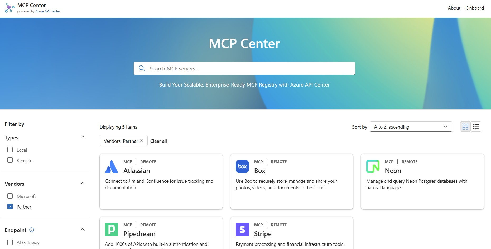
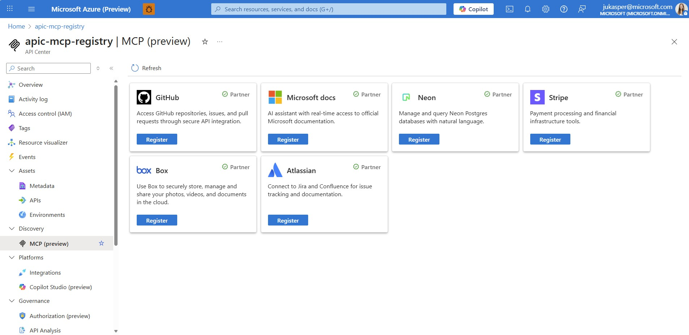

#  Welcome to MCP Center

[MCP Center](https://aka.ms/mcp-center) serves as a showcase illustrating how Azure customers can build their own **enterprise-ready MCP registry**. It's important to understand that this is **not a public registry**; rather, it's a curated collection of MCP servers designed to inspire and guide our customers.

## 💡 Powered by Azure API Center

MCP Center leverages the capabilities of **Azure API Center**, a private enterprise MCP registry. Azure API Center provides a centralized hub to catalog, manage, and share your organization's and third-party MCP servers within your company. It's a powerful tool for **MCP server governance, discovery, and reuse**.

> **Good news!** Azure API Center can be created for **free** in any Azure subscription. You can find the official documentation and learn more about its capabilities here: [Azure API Center documentation](https://learn.microsoft.com/azure/api-center/set-up-api-center)

## 🌟 Your Opportunity: Join the Azure MCP Ecosystem

Every Azure API Center includes an **MCP Discovery Page** to highlight remote MCP partner servers (🔜 local). This offers a direct opportunity for Azure customers to register third-party MCP servers into their own registry, with optional integration behind an [AI Gateway/API Management](https://learn.microsoft.com/en-us/azure/api-management/genai-gateway-capabilities).

### 🚀 Why Partner with Us?
By joining the Azure MCP ecosystem and showcasing your MCP servers, you unlock the following opportunities:

| 🎯 **Benefit** | 📈 **Impact** |
|----------------|---------------|
| **🌐 Boost Visibility & Adoption** | Get your MCP servers in front of a broad audience of Azure customers, dramatically increasing discoverability and adoption potential |
| **🔒 Streamline Governance & Compliance** | Leverage centralized registry benefits for easier governance and management, ensuring your servers meet enterprise security and compliance standards |
| **⚡ Lead the AI Revolution** | Position your organization at the forefront of AI innovation within Azure's rapidly evolving ecosystem |

> 💡 **Exciting Future**: Azure API Center will soon support the Azure AI Foundry tool catalog, meaning partners can expand their reach by integrating with both Azure API Center **and** Azure AI Foundry!

## 🚀 How to Onboard Your MCP Server

Ready to join the Azure MCP ecosystem? If you want to onboard your MCP server and make it discoverable through the Azure API Center's MCP Discovery Page, follow these simple steps:

### Step 1: Express Your Interest
📝 **Comment on [this issue](https://github.com/Azure/mcp-center/issues/4)** to let us know you're interested in joining the ecosystem.

### Step 2: Provide Your MCP Server Details
Please share the following information about your MCP server:

| **🔧 MCP Type** | Specify if your server is `local` or `remote` |
| **📛 MCP Server Name** | The official name of your MCP server |
| **📄 Brief Description** | A concise overview of what your MCP server does and its primary use cases |
| **🔐 OAuth 2.1 Support** | Does it offer the latest streamable HTTP with OAuth 2.1 authentication for remote? (Yes/No) |
| **🐙 GitHub Repository** | Link to your public GitHub repository (if available) |
| **🎨 Icon URL** | Link to your company/server icon |
| **📂 Category** | Choose from: Developer Tools, Productivity, Data & Analytics, Business Services, Cloud & Infrastructure, Other |

### Step 3: Review & Onboarding
Once we receive your information, our team will:
- 🔍 **Review** your submission
- 🤝 **Initiate** the onboarding process  
- 📋 **Guide** you through the registration steps
- ✨ **Display** your MCP server on the MCP Discovery Page in Azure PI Center on the MCP Center webpage

⏱️ **Timeline**: The complete onboarding process typically takes 1-2 weeks from submission to having your MCP server live on the discovery page in Azure and in our MCP Center demo page.

Ready to get started or have more questions? Let us know!

**Your Azure API Center Team**

